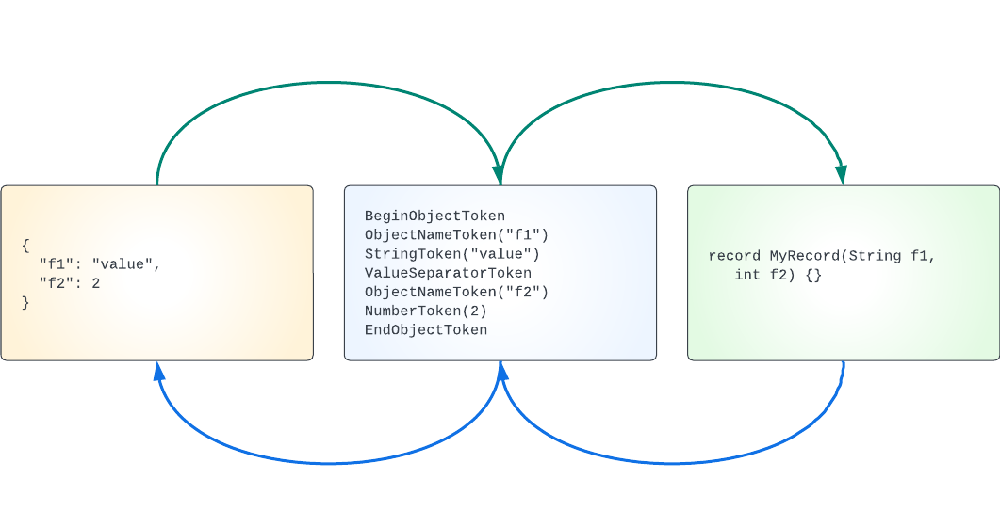

[⬆️ Top](00-introduction.md) • [Next ➡️](02-serialization.md)

# Bleeding Edge Java

_Note: this is Part 1 of this series. Please [start at the introduction](00-introduction.md) if you haven't already_.

## Part 1 - Designing a JSON model

A JSON library needs to: a) parse and comprehend JSON text; b) map the JSON to Java objects; c) map Java objects
to JSON text. What is JSON text? [RFC 8259](https://www.rfc-editor.org/rfc/rfc8259) is the current best description of JSON: 
JavaScript Object Notation. The RFC describes "JSON Values":

> A JSON value MUST be an object, array, number, or string, or one of the following three literal names: `false`, `null`, `true`. The literal names MUST be lowercase.  No other literal names are allowed.

In addition, the RFC describes "six structural characters":

> begin-array = `[` left square bracket
>
> begin-object = `{` left curly bracket
>
> end-array = `]` right square bracket
>
> end-object = `}` right curly bracket
>
> name-separator = `:` colon
>
> value-separator = `,` comma

Let's use some newer features of Java to model the JSON RFC: records and sealed interfaces. A [record](https://docs.oracle.com/en/java/javase/18/language/records.html)
is a type of [algebraic data type](https://en.wikipedia.org/wiki/Algebraic_data_type) that
declares a Java class that also specifies the data associated with that class.
A [sealed interface](https://docs.oracle.com/en/java/javase/18/language/sealed-classes-and-interfaces.html)
is a base interface that limits which classes can implement it. Sealing an interface
allows code to be written that can have a hierarchy that is limited to a well known
set of implementations. It also allows for writing pattern matches that are known
at compile time to be complete (pattern matches will be explained in a later article in this series).

We can create a sealed interface for our JSON models that defines a general type for a JSON token and limits
the set of allowed tokens. The syntax for this is:

```java
public sealed interface JsonToken {
    // ... TODO ...
}
```

This looks like a normal Java interface with the addition of the keyword `sealed`. A `sealed` interface or class
encloses or "seals" any of its inner classes (note: there are other ways to seal classes not discussed here). For
each specific JSON token we could use a standard Java `class`. Instead, we will use Java's new `record`. A Java
record is a concise description of a class and the data associated with the class. The Java compiler adds any needed 
boilerplate methods such as accessors, standard methods, etc. Additionally, Java records are immutable. Given the
JSON RFC we might define token records for: begin array, begin object, end array, end object, name separator,
value separator as well as the JSON value types: number, string or literal. However, let's simplify the RFC
just a little: let's design a token for an "object name" that combines a string value and a name separator. This
will pay benefits later on. Given this, our model definition looks like this:

```java
public sealed interface JsonToken
{
    record BeginArrayToken()
            implements JsonToken {}
    
    record EndArrayToken()
            implements JsonToken {}

    record BeginObjectToken()
            implements JsonToken {}

    record EndObjectToken()
            implements JsonToken {}

    record ObjectNameToken(String name)
            implements JsonToken {}

    record ValueSeparatorToken()
            implements JsonToken {}

    record StringToken(String value)
            implements JsonToken {}

    record NumberToken(Number value)
            implements JsonToken {}

    record BooleanToken(boolean value)
            implements JsonToken {}

    record NullToken()
            implements JsonToken {}
}
```

Some invariants about this definition:

- All the record tokens implement `JsonToken`
- Users of this library cannot define new JsonToken types
- We can now write code that relies on the fact that there is a known, limited set of JSON token types
- Notice how little code is needed to fully specify the model. In the past Java was accused of being verbose. It's no longer the case.

With this hierarchy we have an abstract way to describe a JSON object. We can parse JSON text into a list of these
tokens, or we can destructure a Java object into a list of tokens as shown in this figure:



## Summary

We have a simple model for JSON tokens. We've learned how to use Java records and sealed interfaces. Next we will use
this model to continue developing our JSON library.

# We're hiring

Want to be able to use the latest features of Java? [We're hiring!](https://www.starburst.io/careers/)

------------

_About the author:_

_Jordan Zimmerman is a Software Engineer working on [Starburst Galaxy](https://www.starburst.io/platform/starburst-galaxy/)_ 
