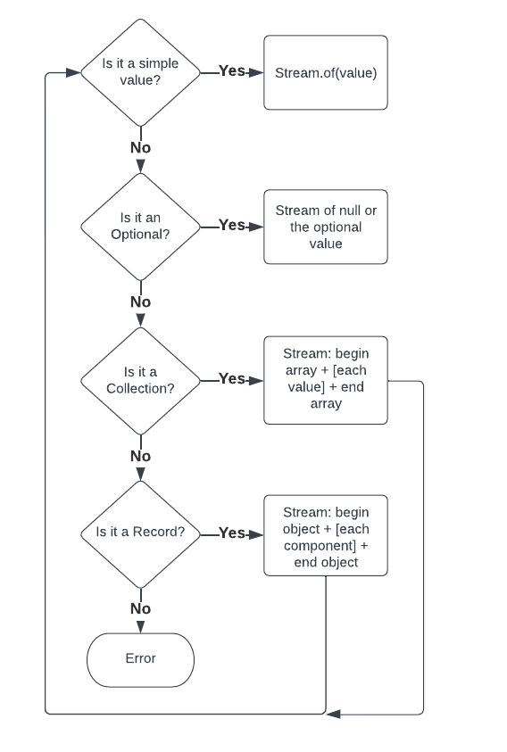

[⬆️ Top](00-introduction.md) • [⬅️ Previous](01-design.md) • [Next ➡️](03-printing.md)

# Bleeding Edge Java

_Note: this is Part 2 of this series. Please [start at the introduction](00-introduction.md) if you haven't already_.

## Part 2 - Serialization

Serializing a Java object is the process of taking the in-memory state of an object and translating it into a representation
that can be stored. In this case, that representation is JSON. Now that we have a model for [JSON tokens](01-design.md) our
goal is to convert Java objects into a list of JSON tokens. For simple Java objects such as primitives like `int`, `boolean`, etc.
or simple Java classes like `String` this is straightforward. However, serializing Java classes has traditionally been 
complicated. There is no standard way to determine what the representative state of a Java class should be. Most existing
serialization libraries rely on annotations to help discover what the state should be. Java records, however, now
allow us to know what the representation of a Java class should be without the need for extra-class metadata such
as annotations. For the first version of our library we will limit the types that can be serialized only to Java instances
that need no extra metadata to know what their storage representation should be:

- Primitives (`int`, `double`, etc.)
- Strings
- Enumerations (enumeration constants always have a name)
- `null`
- Records
- `Optional` of any of the above
- `Collection` of any of the above

The general algorithm for our serializer is:

```text
Java Object -> [token1, token2, ...]
```

We can define a Java interface for this:

```java
public interface JsonSerializer
{
    Stream<JsonToken> serialize(Object o);
}
```

It's a deceptively simple declaration which literally says: "for an object return a stream of JSON tokens". Is it also
simple to write? _Mostly_. Here's our decision flow:



We can now code this flow using bleeding edge preview features of Java 19: record patterns and pattern matching for switch:

```java
public interface JsonSerializer
{
    default Stream<JsonToken> serialize(Object o)
    {
        return switch (o) {
            case null -> Stream.of(new JsonToken.NullToken());
            case String str -> Stream.of(new JsonToken.StringToken(str));
            case Number n -> Stream.of(new JsonToken.NumberToken(n));
            case Boolean b -> Stream.of(new JsonToken.BooleanToken(b));
            case Enum<?> e -> Stream.of(new JsonToken.StringToken(e.name()));
            case Optional<?> optional -> serialize(optional.orElse(null));
            case Collection<?> collection -> serializeCollection(collection);
            case Object ignore when o.getClass().isRecord() -> serializeRecord(o);
            default -> throw new IllegalArgumentException();    // we don't support this type
        };
    }
}
```

We still need to define `serializeCollection()` and `serializeRecord()` but let's first describe what's going on with the switch statement. 

### Enhanced `switch` and patterns

We're all familiar with `switch` statements from Java and most other languages. In Java 19, switch is much more powerful with these additional features:

- Can switch on any object
- Use the "arrow" operator to obviate the need for `break` and old-style switch fall-through
- Case labels can be patterns
- Switch statements can return values

A pattern is an expression that determines whether the object being switched matches the case. In the example shown above each case statement will be translated into quasi if-statements. The first case statement will turn into:
`if o == null`, then `if (o instanceof String)`, etc. This String case also uses Java's "Pattern Matching for instanceof" feature to bind a new variable `str` if o 
is indeed a String. This is equivalent to:

```java
if (o instanceof String) {
    String str = (String) o;
    ...
}
```

The final case statement uses a `when` statement. Java first does the pattern match `if o instanceof Object` and if that's true it will test the "when" statement.
This is equivalent to:

```java
if (o instanceof Object) {
    if (o.getClass().isRecord()) {
        ...
    }
}
```

Pattern matching for switch requires us to provide a variable to bind the match, so we name it `ignore` as we won't be using it.

### Collections and records

Let's address writing `serializeCollection()` and `serializeRecord()`. First, serializeCollection. Serializing a collection must write
a BeginArray token, write tokens for each value in the collection separated by ValueSeparator tokens ending with an EndArray token. The pseudocode
for this is:

```text
emit(BeginArray)
collection.forEach(value -> emit(serialize(value) + separator);
emit(EndArray)
```

You may notice a small problem. Our `serialize()` method returns a `Stream<JsonToken>` but our pseudocode calls `serialize()` recursively. 
This is easily solved using Stream's `flatMap` to take a stream of streams of JsonTokens and flatten them into a simple stream of JsonTokens. Here's an
example:

```java
Stream<Stream<JsonToken>> streamOfStreamOfTokens = Stream.of(serialize(value1), serialize(value2), serialize(value3));
Stream<JsonToken> streamOfTokens = streamOfStreamOfTokens.flatMap(Function.identity());
```

What's happening here: hopefully it's clear that `Stream.of(serialize(value1), serialize(value2), serialize(value3))` produces a stream where each 
element of the stream is, itself, a stream of JsonToken. We then take this stream of streams and call Java's `flatMap` method. `flatMap` takes
a mapping function which receives each element of the stream and returns a new stream which Java expands into a stream of elements as if it was
"flattened". We don't actually need to map here so we use Java's `Function.identity()` helper which translates to `stream -> stream` - i.e it returns
itself. Here's some pseudocode that shows the process (this isn't what actually happens but can be thought of happening in a similar manner):

```java
// given Stream<Stream<JsonToken>> and mappingFunction
Stream.Builder<JsonToken> streamBuilder = ...
for (Stream<JsonToken> tokenStream : streamOfStreams) {
    Stream<JsonToken> mappedStream = mappingFunction.apply(tokenStream);    // with Function.identity() just returns itself
    for (JsonToken token: mappedStream) {
        streamBuilder.accept(token)
    }
}
return streamBuilder.build();
```

We can now write `serializeCollection()`:

```java
default Stream<JsonToken> serializeCollection(Collection<?> collection)
{
    Stream.Builder<Stream<JsonToken>> builder = Stream.builder();
    builder.accept(Stream.of(new JsonToken.BeginArrayToken())); // we have to wrap the token in a stream as we want a stream of streams
    boolean first = true;
    for (Object value : collection) {
        if (first) {
            first = false;
        }
        else {
            builder.accept(Stream.of(new JsonToken.ValueSeparatorToken()));    // again, wrap the token in a stream
        }
        builder.accept(serialize(value));   // recursively serialize each value
    }
    builder.accept(Stream.of(new JsonToken.EndArrayToken()));   // again, wrap the token in a stream
    return builder.build().flatMap(Function.identity());    // flatten stream of streams into stream of tokens
}
```

We can also now write `serializeRecord()`:

```java
default Stream<JsonToken> serializeRecord(Object record)
{
    RecordComponent[] recordComponents = record.getClass().getRecordComponents();   // Java records include a complete specification of the record's components
    Stream.Builder<Stream<JsonToken>> builder = Stream.builder();
    builder.accept(Stream.of(new JsonToken.BeginObjectToken()));    // again, wrap the token in a stream
    boolean first = true;
    for (RecordComponent recordComponent : recordComponents) {
        if (first) {
            first = false;
        }
        else {
            builder.accept(Stream.of(new JsonToken.ValueSeparatorToken())); // again, wrap the token in a stream
        }
        builder.accept(Stream.of(new JsonToken.ObjectNameToken(recordComponent.getName())));    // for now, use the record component name - in future versions we might re-format the name
        try {
            Object o = recordComponent.getAccessor().invoke(record);    // use the record's accessor to get its value via reflection
            builder.accept(serialize(o));      // recursively serialize each value
        }
        catch (IllegalAccessException | InvocationTargetException e) {
            throw new RuntimeException(e);
        }
    }
    builder.accept(Stream.of(new JsonToken.EndObjectToken()));
    return builder.build().flatMap(Function.identity());
}

```

Astute readers will note that both `serializeCollection()` and `serializeRecord()` could be made more efficient in the manner that they recursively
serialize. In the above implementation there is the possibility to create unnecessarily long chains of token streams. It would be better if we could lazily serialize 
list/record components. In fact we can:

```java
private Stream<JsonToken> lazySerialize(Object o)
{
    // use an iterator to delay the serialization until the stream is processed
    // this prevents large objects from creating an unnecessarily large chain of token streams
    Iterator<Stream<JsonToken>> tokenStreamIterator = new Iterator<>() 
    {
        private boolean hasNext = true;

        @Override
        public boolean hasNext()
        {
            return hasNext;
        }

        @Override
        public Stream<JsonToken> next()
        {
            if (hasNext) {
                hasNext = false;
                return serialize(o);
            }
            throw new NoSuchElementException();
        }
    };
    return StreamSupport.stream(Spliterators.spliteratorUnknownSize(tokenStreamIterator, 0), false).flatMap(Function.identity());
}
```

Here the iterator delays the actual serialization until the JDK streams library actually needs the result. 

# Test it out for yourself!

This serialization framework is a surprisingly small amount of code. It's small enough, in fact, to run in `jshell`. This example
will use these files:

- [TypeToken.java](https://raw.githubusercontent.com/starburstdata/developer-blog-assets/main/bleeding-edge-java/code/TypeToken.java) (needed utility - explained in a later article in this series)
- [JsonToken.java](https://raw.githubusercontent.com/starburstdata/developer-blog-assets/main/bleeding-edge-java/code/JsonToken.java)
- [JsonSerializer.java](https://raw.githubusercontent.com/starburstdata/developer-blog-assets/main/bleeding-edge-java/code/JsonSerializer.java)

From a terminal with Java 19 installed, run:

```shell
wget -nc https://raw.githubusercontent.com/starburstdata/developer-blog-assets/main/bleeding-edge-java/code/TypeToken.java
wget -nc https://raw.githubusercontent.com/starburstdata/developer-blog-assets/main/bleeding-edge-java/code/JsonToken.java
wget -nc https://raw.githubusercontent.com/starburstdata/developer-blog-assets/main/bleeding-edge-java/code/JsonSerializer.java
jshell --enable-preview TypeToken.java JsonToken.java JsonSerializer.java
```

Inside jshell you can now test some serializations:

```text
var serializer = JsonSerializer.instance();

// serialize a simple number and output each JsonToken to standard out
serializer.serialize(1).forEach(System.out::println);

// serialize a null and output each JsonToken to standard out
serializer.serialize(null).forEach(System.out::println);

// Define a complex record
record Person(String name, int age) {}
enum Level {JUNIOR, MID, SENIOR}
record Employee(Person person, Level level, Optional<String> detail) {}

Employee e1 = new Employee(new Person("jp", 42), Level.MID, Optional.empty());
Employee e2 = new Employee(new Person("ar", 19), Level.JUNIOR, Optional.of("jp's intern"));

// serialize a list of employees
serializer.serialize(List.of(e1, e2))   // serialize list of employees to a stream of JsonToken
    .forEach(System.out::println);      // print each token to standard out
```

# Summary

We now have a simple framework for serializing well-defined Java objects. The code needed to do this is surprisingly small and simple. 

# We're hiring

Want to be able to use the latest features of Java? [We're hiring!](https://www.starburst.io/careers/)

------------

_About the author:_

_Jordan Zimmerman is a Software Engineer working on [Starburst Galaxy](https://www.starburst.io/platform/starburst-galaxy/)_ 
