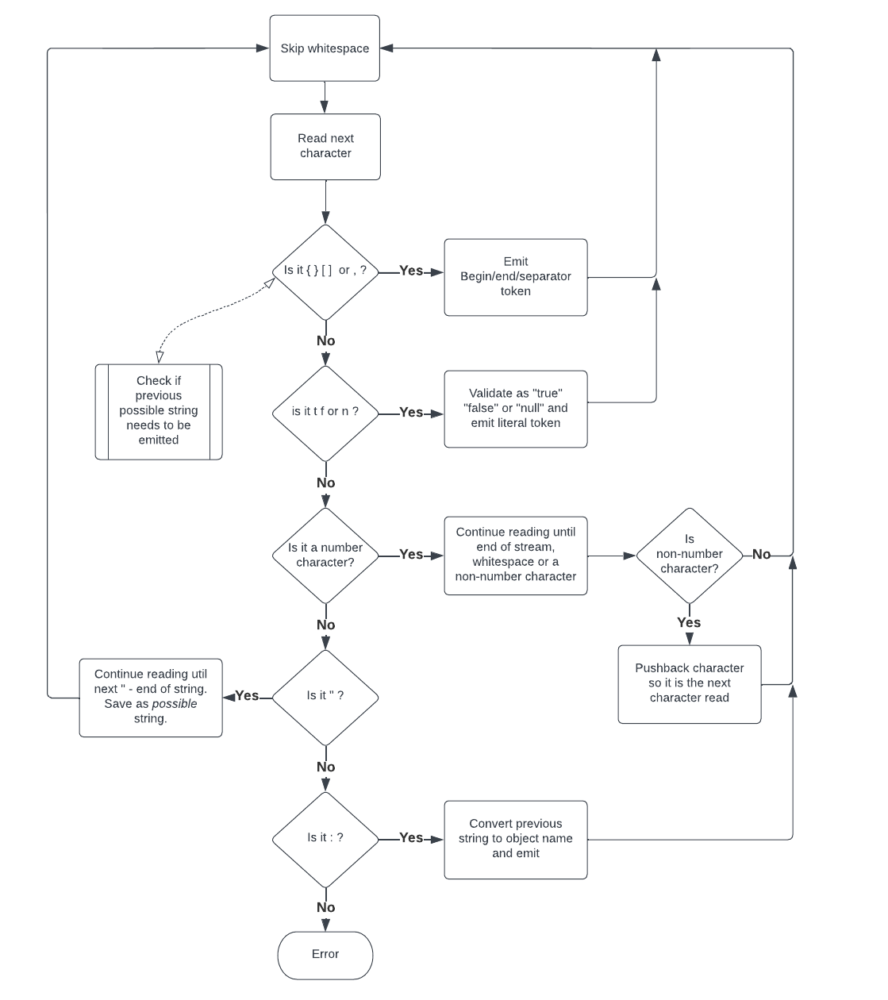

[⬆️ Top](00-introduction.md) • [⬅️ Previous](03-printing.md) • [Next ➡️](05-deserialization-01.md)

# Bleeding Edge Java

_Note: this is Part 4 of this series. Please [start at the introduction](00-introduction.md) if you haven't already_.

## Part 4 - Parsing

Parsing is the process of interpreting free form JSON text and converting it into a stream of JSON tokens. The
[JSON Spec](https://www.rfc-editor.org/rfc/rfc8259) defines the manner in which parsing should be done: what
constitutes whitespace, escape sequences in strings, etc. In short, take a stream of characters and interpret
those characters as a stream of JSON tokens. We can define a Java interface for this:

```java
public interface JsonParser
{
    Stream<JsonToken> parse(IntStream stream);  // Note: Java Strings can be streamed via the chars() method
}
```

Instead of a normal Java `Stream` we need to use an `IntStream` as we're dealing with primitive values: characters. Java does not have
a `CharStream` so `IntStream` will suffice.

There are a number of wrinkles we'll have to deal with when interpreting characters:

- We sometimes need to look ahead before we know what token type is implied (for literals, strings, numbers)
- Our library introduces an object name token. This means that when we parse a string we need to wait for the next token. If it's a `:` we have to convert the string into an object name.
- Number tokens can possibly end with a parseable character: `,` `[` `{`. When this happens we need to reprocess that character.

Here is the general flow for parsing JSON text:



## The code

Java streams process an element at a time and don't allow arbitrary forward/backward access. This limitation would make writing a parser very difficult. Fortunately,
a stream can be converted into an Iterator which allows the parser to continue accessing characters in the stream as needed. The stream method `iterator()`
is used to access this iterator whose type has the unfortunately complex name `PrimitiveIterator.OfInt`. 

Another issue with Java streams is that it's not simple to generate a stream with an unknown length. The management of stream ending occurs in the JDK and there
aren't exposed methods to control this. However you can easily convert an Iterator to a stream. Our parser can create an Iterator internally which can continue
to return tokens until parsing is complete and then its `hasNext()` method can return `false`.

Putting this together we will need these variables:

- `PrimitiveIterator.OfInt iterator` - the iterator of the character stream being processed
- `JsonToken.StringToken previousStringToken` - this holds the most recently parsed string or is `null`
- `int pushedBack` - this is the possibly pushed back character from number parsing or -1
- `JsonToken nextToken` - the next token to be returned by the iterator created in our parser

Our parser implementation looks like this:

```java
Stream<JsonToken> parse(IntStream stream)
{
    Iterator<JsonToken> tokenIterator = new Iterator<>() {
        ...
    };
    return StreamSupport.stream(Spliterators.spliteratorUnknownSize(tokenIterator, 0), false);  // standard method of converting an Iterator to a stream
}
```

The first step in our internal iterator is to prepare our state variables:

```java
private final StringBuilder builder = new StringBuilder();          // contains currently being parsed string, number, etc.
private final PrimitiveIterator.OfInt iterator = stream.iterator(); // stream of characters being processed as an Iterator
private JsonToken.StringToken previousStringToken;                  // the most recently parsed string or null
private int pushedBack = -1;                                        // possibly pushed back character from number parsing or -1
private JsonToken nextToken;                                        // next token to be returned by the iterator created in our parser
```

The `hasNext()` implementation for our iterator is straightforward:

```java
public boolean hasNext()
{
    return (previousStringToken != null) || (nextToken != null);
}
```

The majority of the implementation in our iterator will be in the method `advanceToNextToken()` which advances to the next token in the stream updating
the state variables in the process. Before we show this let's show the implementation for the `next()` method of our iterator:

```java
public JsonToken next()
{
    JsonToken result;
    if (previousStringToken != null) {  // we have a previous string that isn't an object name - emit it and clear
        result = previousStringToken;
        previousStringToken = null;
    }
    else {
        result = nextToken;         // emit and clear the next token
        nextToken = null;
    }
    if (result == null) {
        throw new RuntimeException();   // next() was called when hasNext() returned false
    }
    advanceToNextToken();       // advance to the next token
    return result;
}
```

Now we implement `advanceToNextToken()`. First let's advance past any whitespace unless there's a pushed-back character:

```java
if (pushedBack < 0) {
    pushedBack = advanceWhitespace(iterator);   // note: advanceWhitespace() can generate a new pushed-back character
}
```

Next we loop over characters from the character stream until we have a token. 

```java
String possibleObjectName = null;   // set when a string is processed
while ((nextToken == null) && ((pushedBack >= 0) || iterator.hasNext())) {
    char c = (char) (((pushedBack >= 0) ? pushedBack : iterator.nextInt()) & 0xffff);
    pushedBack = -1;
    
    ... process character ...
}
if (possibleObjectName != null) {
    // wasn't an object name - we now have to emit this string token first
    previousStringToken = new JsonToken.StringToken(possibleObjectName);
}
```

We only need to process each character - again using enhanced switch:

```java
nextToken = switch (c) {
    case '{' -> new JsonToken.BeginObjectToken();
    case '}' -> new JsonToken.EndObjectToken();
    case '[' -> new JsonToken.BeginArrayToken();
    case ']' -> new JsonToken.EndArrayToken();
    case ',' -> new JsonToken.ValueSeparatorToken();
    case '"' -> {
        if (possibleObjectName != null) {
            throw new RuntimeException();   // can't have more than one string 
        }
        possibleObjectName = StringUtils.parseString(builder, iterator);    // it may be an object name so we have to keep parsing
        yield null;
    }
    case 't' -> parseLiteral(iterator, "rue", new JsonToken.BooleanToken(true));    // see the Java source for details on parseLiteral()
    case 'f' -> parseLiteral(iterator, "alse", new JsonToken.BooleanToken(false));
    case 'n' -> parseLiteral(iterator, "ull", new JsonToken.NullToken());
    case '0', '1', '2', '3', '4', '5', '6', '7', '8', '9', '-', '+', '.', 'e', 'E' -> new JsonToken.NumberToken(StringUtils.parseNumber(builder, c, iterator, i -> pushedBack = i)); // see Java source for details on StringUtils.parseNumber     
    case ':' -> {
        if (possibleObjectName == null) {
            throw new RuntimeException();   // illegal state - ':' without a preceeding string
        }
        JsonToken.ObjectNameToken objectNameToken = new JsonToken.ObjectNameToken(possibleObjectName);
        possibleObjectName = null;
        yield objectNameToken;
    }
    default -> {
        if (StringUtils.isWhitespace(c)) {
            yield null; // ignore whitespace between tokens
        }
        throw new RuntimeException();   // unexpected character
    }
};
```

See [JsonParser.java](https://raw.githubusercontent.com/starburstdata/developer-blog-assets/main/bleeding-edge-java/code/JsonParser.java) for the full implementation.

# Test it out for yourself!

In the previous articles we developed a serializer and a printer. Now we can reverse the process and take JSON text to produce a stream
of JSON tokens. Let's put this together in jshell. This example
will use these files:

- [TypeToken.java](https://raw.githubusercontent.com/starburstdata/developer-blog-assets/main/bleeding-edge-java/code/TypeToken.java)
- [JsonToken.java](https://raw.githubusercontent.com/starburstdata/developer-blog-assets/main/bleeding-edge-java/code/JsonToken.java)
- [JsonSerializer.java](https://raw.githubusercontent.com/starburstdata/developer-blog-assets/main/bleeding-edge-java/code/JsonSerializer.java)
- [StringUtils.java](https://raw.githubusercontent.com/starburstdata/developer-blog-assets/main/bleeding-edge-java/code/StringUtils.java)
- [JsonPrinter.java](https://raw.githubusercontent.com/starburstdata/developer-blog-assets/main/bleeding-edge-java/code/JsonPrinter.java)
- [JsonParser.java](https://raw.githubusercontent.com/starburstdata/developer-blog-assets/main/bleeding-edge-java/code/JsonParser.java)

From a terminal with Java 19 installed, run:

```shell
wget -nc https://raw.githubusercontent.com/starburstdata/developer-blog-assets/main/bleeding-edge-java/code/TypeToken.java
wget -nc https://raw.githubusercontent.com/starburstdata/developer-blog-assets/main/bleeding-edge-java/code/JsonToken.java
wget -nc https://raw.githubusercontent.com/starburstdata/developer-blog-assets/main/bleeding-edge-java/code/JsonSerializer.java
wget -nc https://raw.githubusercontent.com/starburstdata/developer-blog-assets/main/bleeding-edge-java/code/StringUtils.java
wget -nc https://raw.githubusercontent.com/starburstdata/developer-blog-assets/main/bleeding-edge-java/code/JsonPrinter.java
wget -nc https://raw.githubusercontent.com/starburstdata/developer-blog-assets/main/bleeding-edge-java/code/JsonParser.java
jshell --enable-preview TypeToken.java JsonToken.java JsonSerializer.java StringUtils.java JsonPrinter.java JsonParser.java
```

Inside jshell let's serialize a Java record into JSON text and then parse that text back into a stream of JSON tokens:

```text
var serializer = JsonSerializer.instance();
var printer = JsonPrinter.instance();
var parser = JsonParser.instance();

record Person(String name, int age) {}
var person = new Person("someone", 28);

serializer.serialize(person)        // serialize to stream of JsonToken
    .map(printer::print)            // map each JsonToken to a String (as a CharSequence)
    .map(CharSequence::chars)       // map each CharSequence to an IntStream
    .flatMap(parser::parse)         // pass each IntStream to the parser and flatten the resulting stream of tokens
    .forEach(System.out::println);  // print each token to standard out
```

# Summary

We can now serialize a Java record into JSON text and then parse that text back into a stream of JSON tokens.

# We're hiring

Want to be able to use the latest features of Java? [We're hiring!](https://www.starburst.io/careers/)

------------

_About the author:_

_Jordan Zimmerman is a Software Engineer working on [Starburst Galaxy](https://www.starburst.io/platform/starburst-galaxy/)_ 
